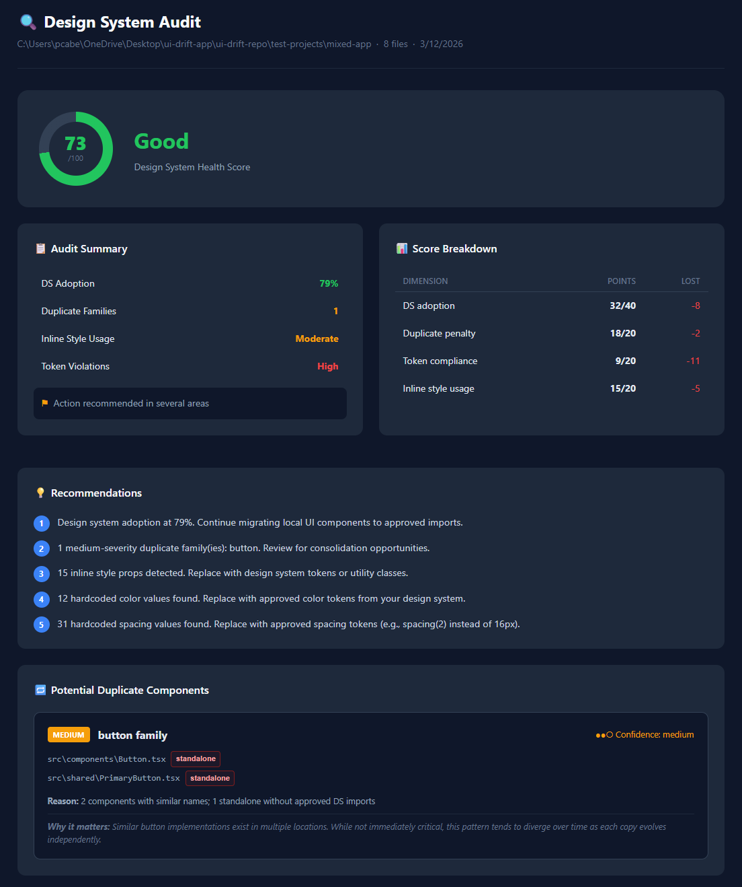

# ui-drift
Detect design system drift before it becomes design system decay.

> Design system health auditor for React / TypeScript codebases.

ui-drift is designed for frontend platform teams, design-system maintainers, and engineering leads who want visibility into UI architecture drift across large React codebases.

It scans your project with AST-based analysis and answers one question: **How healthy is our design system adoption in the actual codebase?** Results come back as a scored, actionable report in the terminal, as JSON, or as a shareable HTML file.

---

## Quick start

```bash
git clone https://github.com/pcabel85/ui-drift.git
cd ui-drift
npm install
npm run build

# Run against one of the included demo repos:
node dist/cli.js test-projects/healthy-app
node dist/cli.js test-projects/mixed-app
node dist/cli.js test-projects/drifted-app

# Audit your own app
node dist/cli.js ./my-app

# Export a shareable HTML report
node dist/cli.js ./my-app --html

# Export machine-readable JSON
node dist/cli.js ./my-app --json

# CI mode — prints only the score, exits 1 if score < 70
node dist/cli.js ./my-app --score-only
```

---

## What it detects

- **DS adoption**: how many UI imports come from approved design system libraries versus local hand-rolled components
- **Duplicate component families**: multiple implementations of the same UI noun (button, card, modal…), classified by severity and confidence
- **Inline styles and token violations**: `style={{}}` props, hardcoded colors, hardcoded spacing values
- **Wrapper component sprawl**: thin wrappers multiplying around the same approved base component

All findings roll up into a **health score from 0–100** across four weighted dimensions.

---

## Terminal output example

```
  ╔══════════════════════════════════════════╗
  ║                 ui-drift                 ║
  ║    Design System Architecture Audit      ║
  ╚══════════════════════════════════════════╝

  Target:        /repos/my-app
  Files scanned: 214
  Mode:          Standard Audit

  ━━━━━━━━━━━━━━━━━━━━━━━━━━━━━━━━━━━━━━━━━━━━

  Analysis Pipeline

  ✓ Loading configuration
  ✓ Discovering source files
  ✓ Identifying React components
  ✓ Analyzing imports
  ✓ Detecting design system usage
  ✓ Checking token compliance
  ✓ Detecting duplicate component families
  ✓ Calculating health score

  ━━━━━━━━━━━━━━━━━━━━━━━━━━━━━━━━━━━━━━━━━━━━

  📋 Audit Summary

  DS Adoption          61%
  Duplicate Families   3
  Inline Style Usage   High
  Token Violations     Moderate
  Discovery Mode       Standard

  ⚑ Top issue: High-severity duplicate component families

  ────────────────────────────────────────────

  Design System Health Score   52/100  Fair
  ██████████░░░░░░░░░░

  Score Breakdown

  DS adoption          25/40   -15
  Duplicate penalty     8/20   -12
  Token compliance     12/20    -8
  Inline style usage   10/20   -10

  ────────────────────────────────────────────

  🔁 Potential Duplicate Components

   HIGH  button family   Confidence: High ●●●
    └─ src/components/Button.tsx            [standalone — no approved DS import]
    └─ src/shared/PrimaryButton.tsx         [standalone — no approved DS import]
    └─ src/features/checkout/CTAButton.tsx  [standalone — no approved DS import]

    Reason: 3 standalones without approved DS imports
    Why it matters: Multiple independent button implementations increase
    maintenance cost and cause visual inconsistency across features.

  ────────────────────────────────────────────

  💡 Top Recommendations

  1. Low design system adoption (61%). Migrate local components to approved
     imports, starting with: Button, PrimaryButton, CTAButton.

  2. 1 high-severity duplicate family: button. Consolidate to a single
     implementation using approved DS components.
```

---

## HTML report example

ui-drift can also export a shareable HTML report for architecture reviews or CI artifacts.



```bash
node dist/cli.js ./my-app --html
```

---

## Configuration

Place `ui-drift.config.json` in the root of the project you are auditing:

```json
{
  "designSystemImports": ["@mui/material", "@mui/icons-material"],
  "internalDSPaths": [],
  "ignorePaths": ["node_modules", "dist", ".next"]
}
```

All fields are optional. See [docs/config.md](docs/config.md) for the full reference including monorepo support (`internalDSPaths`), penalty tuning, and score weight customisation.

### DriftSense

DriftSense is ui-drift's automatic design system discovery engine. If unusually low DS adoption is detected on the first run, DriftSense scans the repository for likely shared UI layers and suggests a configuration automatically.

```bash
# Force DriftSense discovery on any repo
node dist/cli.js ./my-app --detect-ds

# Write the DriftSense suggestion to disk
node dist/cli.js ./my-app --detect-ds --write-config

# Rerun the audit immediately with the suggestion applied
node dist/cli.js ./my-app --detect-ds --rerun-with-suggestion
```

See [docs/driftsense.md](docs/driftsense.md) for the full explanation.

---

## Docs

| Document | Contents |
|---|---|
| [docs/config.md](docs/config.md) | Full configuration reference |
| [docs/scoring-model.md](docs/scoring-model.md) | How the 0–100 score is calculated |
| [docs/json-schema.md](docs/json-schema.md) | JSON output schema reference |
| [docs/architecture.md](docs/architecture.md) | Project structure, data flow, tech stack |
| [docs/philosophy.md](docs/philosophy.md) | Design decisions and guiding principles |
| [docs/driftsense.md](docs/driftsense.md) | DriftSense design system discovery |

---

## Development

```bash
npm install
npm run build

# Run from source without a build step
npm run dev -- ./path/to/project

# Run against the included test projects
node dist/cli.js test-projects/healthy-app
node dist/cli.js test-projects/mixed-app
node dist/cli.js test-projects/drifted-app
```

---

## Roadmap

- [ ] CI mode with exit code based on score delta from baseline
- [ ] GitHub Action
- [ ] Trend reports over time
- [ ] Rule packs for Chakra UI, Tailwind, and custom design systems
- [ ] Team dashboard

---

## Status

Prototype (`v0.2`), currently intended for private feedback and early testing.

---

## License

MIT
